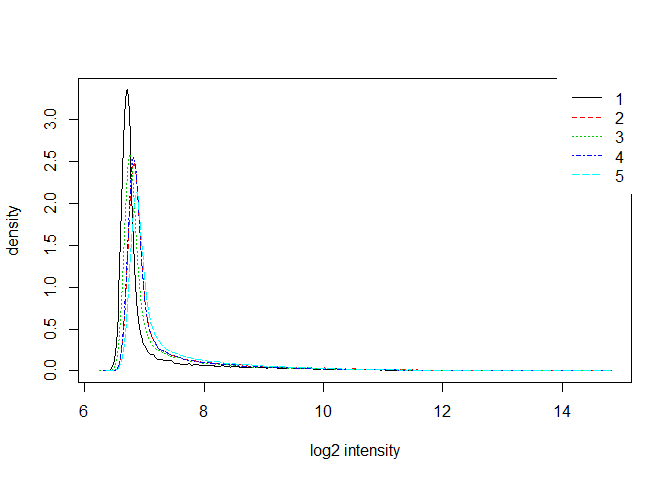
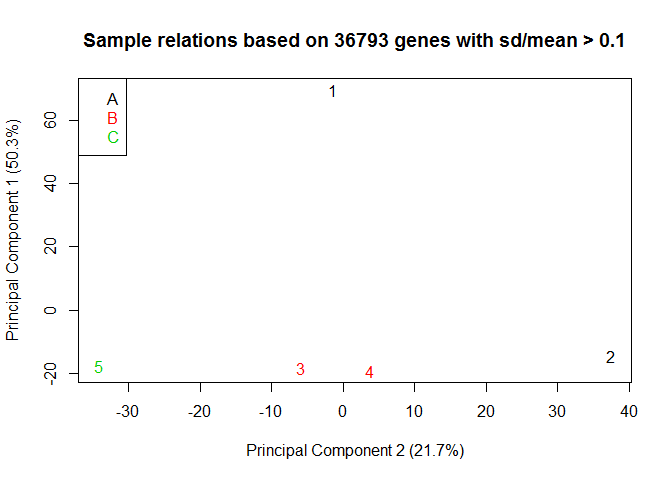
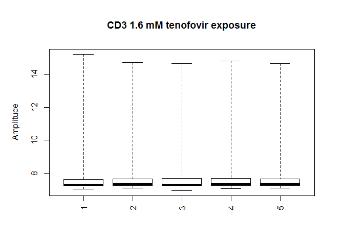

    ## Inputting the data ...
    ## Perform Quality Control assessment of the LumiBatch object ...

SOME PLOTS OF NON NORMALIZED DATA: density plot, cdf plot    

    ## Perform vst transformation ...
    ## 2016-01-05 12:04:26 , processing array  1 
    ## 2016-01-05 12:04:26 , processing array  2 
    ## 2016-01-05 12:04:26 , processing array  3 
    ## 2016-01-05 12:04:26 , processing array  4 
    ## 2016-01-05 12:04:26 , processing array  5 
    ## Perform rsn normalization ...
    ## 2016-01-05 12:04:27 , processing array  1 
    ## 2016-01-05 12:04:27 , processing array  2 
    ## 2016-01-05 12:04:27 , processing array  3 
    ## 2016-01-05 12:04:27 , processing array  4 
    ## 2016-01-05 12:04:27 , processing array  5 
    ## Perform Quality Control assessment of the LumiBatch object ...

PLOTS OF NORMALIZED DATA

   FILTERING PROBES BASED ON DETECTION Limma suggests to keep probes that are expressed above bg on at least n arrays where n is smallest number of replicates assigned to any of the treatment combinations.

how many probes did we have before and after filtering?

    ##          detection exprs se.exprs
    ## Features     47323 47323    47323
    ## Samples          5     5        5

    ##          detection exprs se.exprs
    ## Features     13789 13789    13789
    ## Samples          5     5        5

how many removed?

    ##          detection exprs se.exprs
    ## Features     33534 33534    33534
    ## Samples          0     0        0

Here's the design matrix for the analysis

    ##   concentration0 concentration1600 donorB donorC
    ## 1              0                 1      0      0
    ## 2              1                 0      0      0
    ## 3              0                 1      1      0
    ## 4              1                 0      1      0
    ## 5              0                 1      0      1
    ## attr(,"assign")
    ## [1] 1 1 2 2
    ## attr(,"contrasts")
    ## attr(,"contrasts")$concentration
    ## [1] "contr.treatment"
    ## 
    ## attr(,"contrasts")$donor
    ## [1] "contr.treatment"

Here's the contrasts matrix

    ##                    Contrasts
    ## Levels              MaxVsCtrl
    ##   concentration0           -1
    ##   concentration1600         1
    ##   donorB                    0
    ##   donorC                    0

How many probes are up and down regulated for each contrast?

    ## Source: local data frame [1 x 3]
    ## 
    ##    variable down up
    ## 1 MaxVsCtrl    0  0

SessionInfo()

    ## R version 3.2.1 (2015-06-18)
    ## Platform: x86_64-w64-mingw32/x64 (64-bit)
    ## Running under: Windows 7 x64 (build 7601) Service Pack 1
    ## 
    ## locale:
    ## [1] LC_COLLATE=English_United States.1252 
    ## [2] LC_CTYPE=English_United States.1252   
    ## [3] LC_MONETARY=English_United States.1252
    ## [4] LC_NUMERIC=C                          
    ## [5] LC_TIME=English_United States.1252    
    ## 
    ## attached base packages:
    ## [1] parallel  stats     graphics  grDevices utils     datasets  methods  
    ## [8] base     
    ## 
    ## other attached packages:
    ## [1] ggplot2_1.0.1.9003  reshape2_1.4.1      limma_3.24.14      
    ## [4] lumi_2.20.2         Biobase_2.28.0      BiocGenerics_0.14.0
    ## [7] dplyr_0.4.2        
    ## 
    ## loaded via a namespace (and not attached):
    ##  [1] nor1mix_1.2-1           splines_3.2.1          
    ##  [3] foreach_1.4.2           bumphunter_1.8.0       
    ##  [5] assertthat_0.1          affy_1.46.1            
    ##  [7] stats4_3.2.1            doRNG_1.6              
    ##  [9] Rsamtools_1.20.4        methylumi_2.14.0       
    ## [11] yaml_2.1.13             minfi_1.14.0           
    ## [13] RSQLite_1.0.0           lattice_0.20-33        
    ## [15] quadprog_1.5-5          digest_0.6.8           
    ## [17] GenomicRanges_1.20.5    RColorBrewer_1.1-2     
    ## [19] XVector_0.8.0           colorspace_1.2-6       
    ## [21] htmltools_0.2.6         preprocessCore_1.30.0  
    ## [23] Matrix_1.2-2            plyr_1.8.3             
    ## [25] GEOquery_2.34.0         siggenes_1.42.0        
    ## [27] XML_3.98-1.3            biomaRt_2.24.0         
    ## [29] genefilter_1.50.0       zlibbioc_1.14.0        
    ## [31] xtable_1.7-4            scales_0.2.5.9003      
    ## [33] affyio_1.36.0           BiocParallel_1.2.14    
    ## [35] nleqslv_2.8             annotate_1.46.1        
    ## [37] beanplot_1.2            pkgmaker_0.22          
    ## [39] mgcv_1.8-7              IRanges_2.2.5          
    ## [41] GenomicFeatures_1.20.1  lazyeval_0.1.10        
    ## [43] survival_2.38-3         magrittr_1.5           
    ## [45] mclust_5.0.2            evaluate_0.7.2         
    ## [47] nlme_3.1-121            MASS_7.3-43            
    ## [49] BiocInstaller_1.18.4    tools_3.2.1            
    ## [51] registry_0.3            formatR_1.2            
    ## [53] matrixStats_0.14.2      stringr_1.0.0          
    ## [55] S4Vectors_0.6.2         munsell_0.4.2          
    ## [57] locfit_1.5-9.1          rngtools_1.2.4         
    ## [59] AnnotationDbi_1.30.1    lambda.r_1.1.7         
    ## [61] Biostrings_2.36.1       base64_1.1             
    ## [63] GenomeInfoDb_1.4.1      futile.logger_1.4.1    
    ## [65] grid_3.2.1              RCurl_1.95-4.7         
    ## [67] iterators_1.0.7         labeling_0.3           
    ## [69] bitops_1.0-6            rmarkdown_0.7          
    ## [71] gtable_0.1.2            codetools_0.2-14       
    ## [73] multtest_2.24.0         DBI_0.3.1              
    ## [75] reshape_0.8.5           R6_2.1.0               
    ## [77] illuminaio_0.10.0       GenomicAlignments_1.4.1
    ## [79] knitr_1.11              rtracklayer_1.28.6     
    ## [81] futile.options_1.0.0    KernSmooth_2.23-15     
    ## [83] stringi_0.5-5           Rcpp_0.12.1
