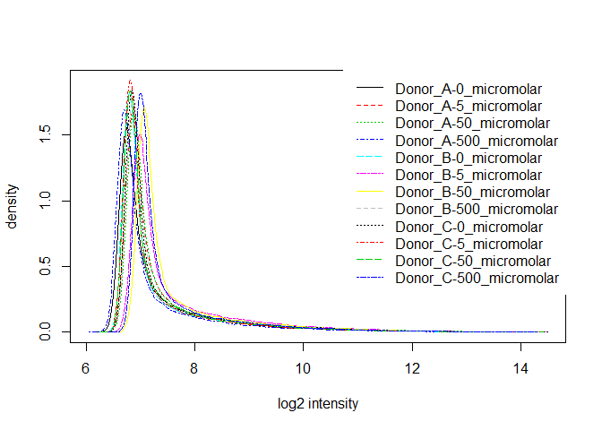
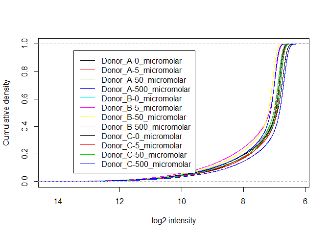
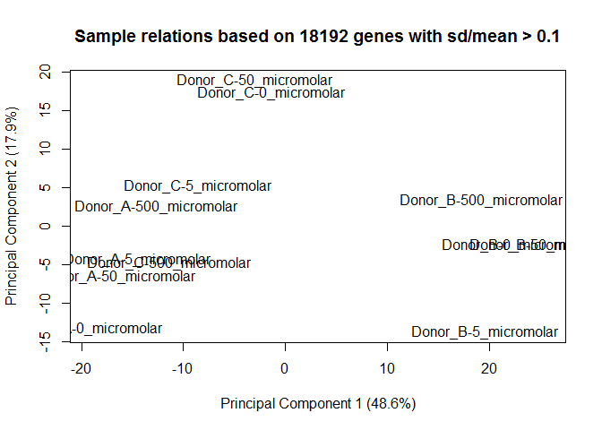
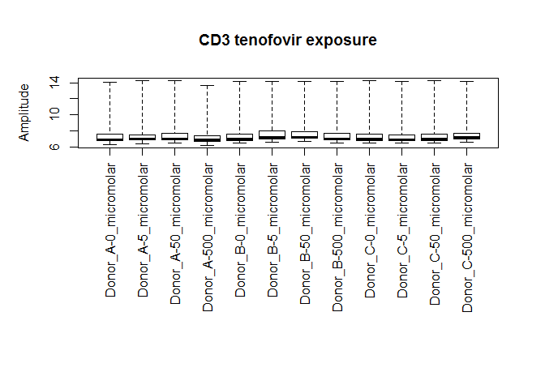
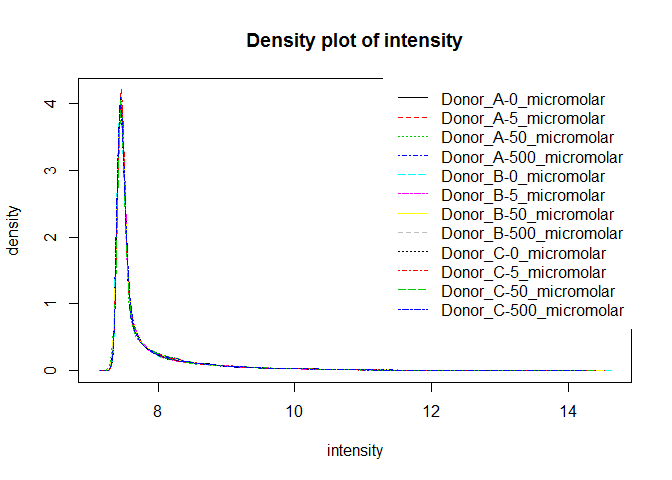
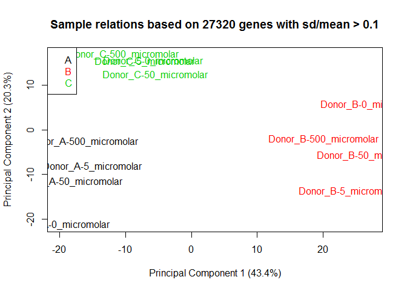
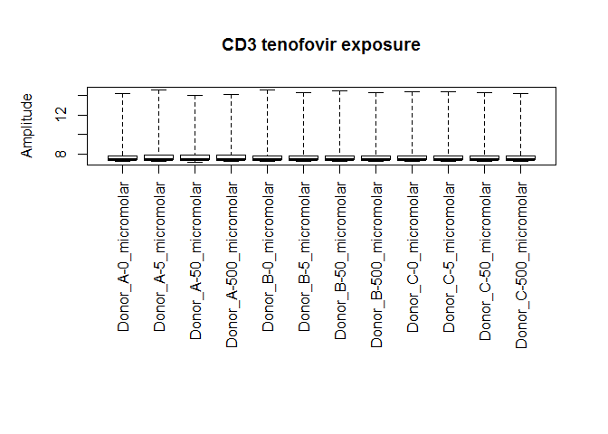

    ## Inputting the data ...
    ## Perform Quality Control assessment of the LumiBatch object ...

SOME PLOTS OF NON NORMALIZED DATA: density plot, cdf plot    

    ## Perform vst transformation ...
    ## 2016-01-05 10:33:18 , processing array  1 
    ## 2016-01-05 10:33:18 , processing array  2 
    ## 2016-01-05 10:33:18 , processing array  3 
    ## 2016-01-05 10:33:18 , processing array  4 
    ## 2016-01-05 10:33:18 , processing array  5 
    ## 2016-01-05 10:33:18 , processing array  6 
    ## 2016-01-05 10:33:18 , processing array  7 
    ## 2016-01-05 10:33:18 , processing array  8 
    ## 2016-01-05 10:33:18 , processing array  9 
    ## 2016-01-05 10:33:18 , processing array  10 
    ## 2016-01-05 10:33:18 , processing array  11 
    ## 2016-01-05 10:33:18 , processing array  12 
    ## Perform rsn normalization ...
    ## 2016-01-05 10:33:19 , processing array  1 
    ## 2016-01-05 10:33:19 , processing array  2 
    ## 2016-01-05 10:33:19 , processing array  3 
    ## 2016-01-05 10:33:19 , processing array  4 
    ## 2016-01-05 10:33:19 , processing array  5 
    ## 2016-01-05 10:33:19 , processing array  6 
    ## 2016-01-05 10:33:19 , processing array  7 
    ## 2016-01-05 10:33:19 , processing array  8 
    ## 2016-01-05 10:33:20 , processing array  9 
    ## 2016-01-05 10:33:20 , processing array  10 
    ## 2016-01-05 10:33:20 , processing array  11 
    ## 2016-01-05 10:33:20 , processing array  12 
    ## Perform Quality Control assessment of the LumiBatch object ...

PLOTS OF NORMALIZED DATA

   FILTERING PROBES BASED ON DETECTION Limma suggests to keep probes that are expressed above bg on at least n arrays where n is smallest number of replicates assigned to any of the treatment combinations.

how many probes did we have before and after filtering?

    ##          detection exprs se.exprs
    ## Features     47323 47323    47323
    ## Samples         12    12       12

    ##          detection exprs se.exprs
    ## Features     19305 19305    19305
    ## Samples         12    12       12

how many removed?

    ##          detection exprs se.exprs
    ## Features     28018 28018    28018
    ## Samples          0     0        0

Here's the design matrix for the analysis

    ##    concentration0 concentration5 concentration50 concentration500 donorB
    ## 1               1              0               0                0      0
    ## 2               0              1               0                0      0
    ## 3               0              0               1                0      0
    ## 4               0              0               0                1      0
    ## 5               1              0               0                0      1
    ## 6               0              1               0                0      1
    ## 7               0              0               1                0      1
    ## 8               0              0               0                1      1
    ## 9               1              0               0                0      0
    ## 10              0              1               0                0      0
    ## 11              0              0               1                0      0
    ## 12              0              0               0                1      0
    ##    donorC
    ## 1       0
    ## 2       0
    ## 3       0
    ## 4       0
    ## 5       0
    ## 6       0
    ## 7       0
    ## 8       0
    ## 9       1
    ## 10      1
    ## 11      1
    ## 12      1
    ## attr(,"assign")
    ## [1] 1 1 1 1 2 2
    ## attr(,"contrasts")
    ## attr(,"contrasts")$concentration
    ## [1] "contr.treatment"
    ## 
    ## attr(,"contrasts")$donor
    ## [1] "contr.treatment"

Here's the contrasts matrix

    ##                   Contrasts
    ## Levels             MaxVsCtrl MidVsCtrl MinVsCtrl
    ##   concentration0          -1        -1        -1
    ##   concentration5           0         0         1
    ##   concentration50          0         1         0
    ##   concentration500         1         0         0
    ##   donorB                   0         0         0
    ##   donorC                   0         0         0

How many probes are up and down regulated for each contrast?

    ## Source: local data frame [3 x 3]
    ## 
    ##    variable down up
    ## 1 MaxVsCtrl    0  0
    ## 2 MidVsCtrl    0  0
    ## 3 MinVsCtrl    0  0

SessionInfo()

    ## R version 3.2.1 (2015-06-18)
    ## Platform: x86_64-w64-mingw32/x64 (64-bit)
    ## Running under: Windows 7 x64 (build 7601) Service Pack 1
    ## 
    ## locale:
    ## [1] LC_COLLATE=English_United States.1252 
    ## [2] LC_CTYPE=English_United States.1252   
    ## [3] LC_MONETARY=English_United States.1252
    ## [4] LC_NUMERIC=C                          
    ## [5] LC_TIME=English_United States.1252    
    ## 
    ## attached base packages:
    ## [1] parallel  stats     graphics  grDevices utils     datasets  methods  
    ## [8] base     
    ## 
    ## other attached packages:
    ## [1] reshape2_1.4.1      limma_3.24.14       lumi_2.20.2        
    ## [4] Biobase_2.28.0      BiocGenerics_0.14.0 dplyr_0.4.2        
    ## 
    ## loaded via a namespace (and not attached):
    ##  [1] nor1mix_1.2-1           splines_3.2.1          
    ##  [3] foreach_1.4.2           bumphunter_1.8.0       
    ##  [5] assertthat_0.1          affy_1.46.1            
    ##  [7] stats4_3.2.1            doRNG_1.6              
    ##  [9] Rsamtools_1.20.4        methylumi_2.14.0       
    ## [11] yaml_2.1.13             minfi_1.14.0           
    ## [13] RSQLite_1.0.0           lattice_0.20-33        
    ## [15] quadprog_1.5-5          digest_0.6.8           
    ## [17] GenomicRanges_1.20.5    RColorBrewer_1.1-2     
    ## [19] XVector_0.8.0           colorspace_1.2-6       
    ## [21] htmltools_0.2.6         preprocessCore_1.30.0  
    ## [23] Matrix_1.2-2            plyr_1.8.3             
    ## [25] GEOquery_2.34.0         siggenes_1.42.0        
    ## [27] XML_3.98-1.3            biomaRt_2.24.0         
    ## [29] genefilter_1.50.0       zlibbioc_1.14.0        
    ## [31] xtable_1.7-4            affyio_1.36.0          
    ## [33] BiocParallel_1.2.14     nleqslv_2.8            
    ## [35] annotate_1.46.1         beanplot_1.2           
    ## [37] pkgmaker_0.22           mgcv_1.8-7             
    ## [39] IRanges_2.2.5           GenomicFeatures_1.20.1 
    ## [41] lazyeval_0.1.10         survival_2.38-3        
    ## [43] magrittr_1.5            mclust_5.0.2           
    ## [45] evaluate_0.7.2          nlme_3.1-121           
    ## [47] MASS_7.3-43             BiocInstaller_1.18.4   
    ## [49] tools_3.2.1             registry_0.3           
    ## [51] formatR_1.2             matrixStats_0.14.2     
    ## [53] stringr_1.0.0           S4Vectors_0.6.2        
    ## [55] locfit_1.5-9.1          rngtools_1.2.4         
    ## [57] AnnotationDbi_1.30.1    lambda.r_1.1.7         
    ## [59] Biostrings_2.36.1       base64_1.1             
    ## [61] GenomeInfoDb_1.4.1      futile.logger_1.4.1    
    ## [63] grid_3.2.1              RCurl_1.95-4.7         
    ## [65] iterators_1.0.7         bitops_1.0-6           
    ## [67] rmarkdown_0.7           codetools_0.2-14       
    ## [69] multtest_2.24.0         DBI_0.3.1              
    ## [71] reshape_0.8.5           R6_2.1.0               
    ## [73] illuminaio_0.10.0       GenomicAlignments_1.4.1
    ## [75] knitr_1.11              rtracklayer_1.28.6     
    ## [77] futile.options_1.0.0    KernSmooth_2.23-15     
    ## [79] stringi_0.5-5           Rcpp_0.12.1
